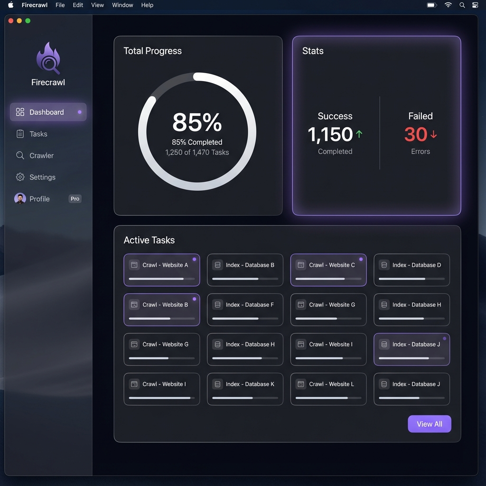

# Firecrawl Scraper GUI - 前端设计规范 (v2.0)

## 1. 设计概述

本项目的 GUI 旨在为 Firecrawl 爬虫提供一个**极简、优雅且专业的 macOS 原生级体验**。设计语言深受 Apple Human Interface Guidelines (HIG) 启发，结合了 Bento Grid（便当盒网格）布局与现代化的毛玻璃质感。

**核心视觉特征**：

* **Bento Grid 布局**: 模块化、结构清晰，通过卡片大小区分信息层级。
* **Edge Lighting (边缘微光)**: 交互的核心亮点。常态下卡片无边框或极淡边框，**仅在鼠标悬停时显现紫色的边缘微光**。
* **Monochrome + Micro-Accents**: 整体黑白灰，极度克制。
  * **紫色 (Purple)**: 仅用于“HOVER 光效”和极个别的“选中态/微点”。
  * **红色 (Red)**: 仅用于“失败”数字，起到警示作用。



---

## 2. 视觉风格指南

### 2.1 配色系统 (Color Palette)

| 颜色名称 | Hex 代码 |用途 |
| :--- | :--- | :--- |
| **App Background** | `#0D0D0D` |应用背景 (接近纯黑) |
| **Card Surface** | `#1C1C1E` |卡片背景 (深灰，带 5% 透明度) |
| **Sidebar Glass** | `#1E1E1E` |侧边栏 (带 Backdrop Blur 20px) |
| **Text Primary** | `#FFFFFF` |主要标题、数字 |
| **Text Secondary** | `#8E8E93` |副标题、说明文字 (Apple System Grey) |
| **Accent Glow** | `#B026FF` |**关键色** - 悬停时的边缘光晕 |
| **Error** | `#FF453A` |失败计数、错误提示 (Apple System Red) |

### 2.2 字体与排版

* **Font Family**: `SF Pro Display` (macOS 默认) / `Inter` (跨平台替代)。
* **Weights**:
  * **Bold (700)**: 用于大数字 (如 "85%") 和模块标题。
  * **Regular (400)**: 用于正文和列表项。
  * **Medium (500)**: 用于按钮文本。

---

## 3. 界面布局 (Layout Specification)

界面采用经典的 **Sidebar + Content Grid** 结构。

### 3.1 左侧导航栏 (Sidebar) - 250px 宽

* **材质**: 半透明毛玻璃 (VisualEffectView 模拟)。
* **Logo 区**: 顶部 Firecrawl Logo + 文字。
* **导航项**:
  * `Dashboard` (默认选中，选中态左侧有一个极小的紫色圆点 `Glow Dot`)。
  * `Tasks` (任务列表视图)。
  * `Settings` (配置页)。
* **底部**: 简单的用户信息或版本号。

### 3.2 内容区域 (Content Area) - 弹性宽度

内容区采用 **Bento Grid** 布局，包含三个核心模块：

#### A. 总体进度卡片 (Total Progress) - `[Top Left]`

* **内容**: 一个巨大的环形进度条 (Circular Gauge)。
* **视觉**:
  * 背景轨道: 深灰 (`#333`)。
  * 进度填充: 亮白 (`#FFF`，纯净感)。
  * 中心文字: 显示当前百分比 (如 "85%") 和具体的 `1250 / 1470`。

#### B. 统计概览卡片 (Stats) - `[Top Right]`

* **内容**: 左右分栏显示。
  * **Success**: 纯白数字，下方小字 "Completed"。
  * **Failed**: **鲜红色**数字，下方小字 "Errors"。
* **交互**: 鼠标滑过时，卡片四周泛起紫色微光。

#### C. 活跃任务矩阵 (Active Tasks) - `[Bottom Large]`

* **内容**: 一个网格列表，展示当前并发运行的线程 (例如 12-15 个小卡片)。
* **子卡片样式**:
  * 每个小卡片是一个矩形，包含：`任务名/URL` + `微型进度条`。
  * **状态**: 运行中显示白色进度条；排队中变暗；完成后稍微高亮并淡出。
* **交互**: 整个区域标题栏可扩充，"View All" 按钮引导至完整列表。

---

## 4. 交互设计细节 (Interaction)

### 4.1 Hover Glow Effect (边缘微光)

这是本设计的灵魂。

* **技术实现**: 使用 CSS `box-shadow` 或 `filter: drop-shadow`。
* **规则**:
  * 默认状态: `border: 1px solid rgba(255,255,255,0.05)`
  * Hover 状态:

        ```css
        border-color: rgba(176, 38, 255, 0.5);
        box-shadow: 0 0 15px rgba(176, 38, 255, 0.2), inset 0 0 10px rgba(176, 38, 255, 0.05);
        transition: all 0.3s ease;
        ```

### 4.2 适配深色/浅色模式 (Theme)

* 虽然主推 Dark Mode，但代码结构应支持 CSS Variables 切换。
* **Light Mode**: 背景变为浅灰 (`#F5F5F7`)，卡片变为纯白，阴影加重，紫色光晕依然有效（会显得更明显）。

---

## 5. 技术实现架构

### 5.1 Electron 架构

* `main.js`: 负责创建窗口、应用菜单、以及通过 `node-pty` 或 `child_process` 运行 Python 脚本。
* `preload.js`: 暴露安全的 IPC API (`window.api.startScrape`, `window.api.onProgress`).

### 5.2 React 组件树

```
App
├── Sidebar (Glassy)
└── DashboardLayout (Grid)
    ├── ProgressCard (Circular)
    ├── StatsCard (Generic Card with HoverGlow)
    └── ActiveTasksGrid
        └── TaskItem (Small Card)
```

### 5.3 数据通信

为了支持高频 UI 更新（活跃任务列表跳动）：

1. Python 端每 100ms 聚合一次状态，通过 JSON 发送。
2. React 端使用 `requestAnimationFrame` 或防抖 (Throttle) 优化渲染，避免界面卡顿。

---

## 6. 开发路线图

1. **脚手架**: 初始化 Electron + React + Tailwind + Framer Motion (用于动画)。
2. **UI 静态还原**: 优先实现 Bento Grid 布局和 Hover 光效。
3. **Python 适配**: 修改爬虫脚本增加 JSON 管道输出。
4. **联调**: 串通 Start 按钮 -> 运行脚本 -> 接收数据 -> 更新 UI 流程。
